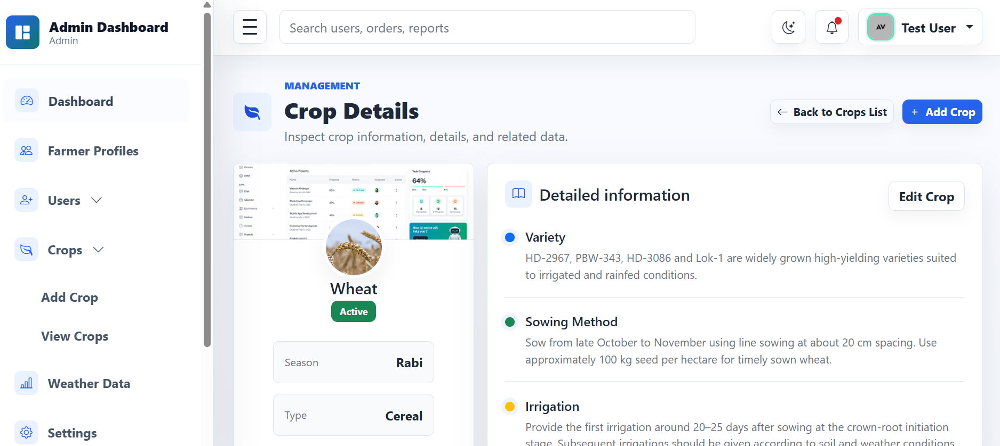
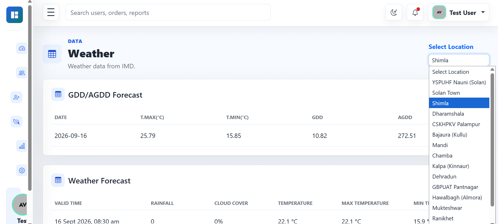

# Laravel Firebase Farmer Platform

A production-ready Laravel application for farmer authentication, location-aware weather intelligence, Firebase-powered farmer management, and a role-based admin dashboard for operational control.

This project combines Laravel 13, Firebase Realtime Database, JWT authentication, Google OAuth, OTP verification, weather services, and a polished admin interface into a single agriculture-focused platform for both API and dashboard use.

## Project Summary

This platform was designed as a smart agriculture backend with a modern management interface. It supports farmer onboarding, secure authentication, weather-aware decision making, and operational oversight from an admin dashboard.

It is structured to demonstrate end-to-end Laravel development capabilities, from API design and authentication to Firebase integration and dashboard-driven admin workflows.

## Overview

The application is designed to support farmer onboarding and engagement with features such as:

- OTP-based phone authentication
- JWT access token generation and refresh flow
- Google sign-in integration
- Farmer profile and location tracking
- Weather data retrieval based on geolocation
- Crop and location discovery endpoints
- Firebase-backed farmer data storage
- Role and permission-based access control
- Admin dashboard for managing users, farmers, crops, and weather data
- Secure admin-only and editor/admin routes for internal operations

## Tech Stack

- PHP 8.3+
- Laravel 13
- Firebase PHP SDK
- Firebase Realtime Database
- JWT Auth
- Laravel Socialite
- MySQL / Laravel database support
- Vite + Tailwind for frontend assets
- Pest for testing

## Key Features

### Authentication and Security
- Phone-number OTP flows for farmer registration and verification
- JWT-based authentication for API access
- Guest session handling
- Token refresh support
- Google OAuth login flow
- Role-based permission system

### Farmer Management
- Farmer creation by phone or Google account
- Status tracking and profile updates
- Online/offline state handling
- Location and settings management

### Admin Dashboard
- Dashboard landing page for overview and metrics
- Role-protected admin and editor access
- User management screens
- Farmer management screens
- Crop management and record viewing
- Weather and agricultural data views
- Clean dashboard UI built for operational monitoring

### Weather and Agricultural Intelligence
- Fetch nearest weather station by coordinates
- Weather data lookup for authenticated users
- GDD (Growing Degree Day) data support
- Agricultural data integrated around user location

### Firebase Integration
- Real-time farmer records stored in Firebase
- Firebase service account configuration
- Shared data access for farm operations and profile syncing

## API Highlights

The app exposes a versioned API under `/api/v1`.

### Auth routes
- `POST /api/v1/auth/otp/send`
- `POST /api/v1/auth/otp/verify`
- `POST /api/v1/auth/guest`
- `POST /api/v1/auth/refresh`
- `GET /api/v1/auth/google`
- `GET /api/v1/auth/google/callback`
- `POST /api/v1/auth/logout`

### User routes
- `GET /api/v1/user/me`
- `PATCH /api/v1/user/location`
- `PATCH /api/v1/user/settings`
- `GET /api/v1/user/weather`

### Crop and location routes
- `GET /api/v1/locations/popular`
- `GET /api/v1/locations/search`
- `POST /api/v1/crops`
- `GET /api/v1/crops/{id}`

## Project Architecture

```bash
app/
├── Auth/
├── Http/
│   ├── Controllers/
│   ├── Requests/
│   └── Middleware/
├── Jobs/
├── Models/
├── Providers/
├── Services/
└── View/
config/
bootstrap/
database/
public/
resources/
├── css/
├── js/
└── views/
routes/
├── api.php
├── auth.php
├── web.php
└── console.php
storage/
tests/
```

### How it works

1. Farmers authenticate through OTP or Google OAuth.
2. JWT tokens secure access to protected API routes.
3. Farmer profiles, status, and location data are stored and managed through Firebase.
4. The admin dashboard provides operational visibility for users, crops, location data, and weather insights.

## Setup Instructions

### Prerequisites

- PHP 8.3 or newer
- Composer
- Node.js and npm
- MySQL database
- Firebase project with Realtime Database enabled

### 1. Install dependencies

```bash
composer install
npm install
```

### 2. Environment configuration

Copy the sample environment file and update it with your local values:

```bash
cp .env.example .env
```

Then configure the following in `.env`:

- `DB_CONNECTION`
- `DB_HOST`
- `DB_PORT`
- `DB_DATABASE`
- `DB_USERNAME`
- `DB_PASSWORD`
- `JWT_SECRET`
- `GOOGLE_CLIENT_ID`
- `GOOGLE_CLIENT_SECRET`
- `GOOGLE_REDIRECT_URI`
- `FIREBASE_CREDENTIALS`
- `FIREBASE_DATABASE_URL`

### 3. Generate application key

```bash
php artisan key:generate
```

### 4. Run migrations and seeders

```bash
php artisan migrate
php artisan db:seed
```

### 5. Run the app

```bash
php artisan serve
npm run dev
```

Or run the full development stack:

```bash
composer run dev
```

## Testing

```bash
php artisan test
```

## Environment and Security Notes

- Keep `.env` local and never commit it to version control.
- Store secrets in a secure environment or secret manager in production.
- Ensure Firebase credentials and OAuth client secrets are managed securely.
- Do not expose private keys in public repositories.

## Demo / Deployment

This project is designed to be deployed as a full-stack agricultural platform with:

- a Laravel API backend
- a secure admin dashboard
- Firebase-backed farmer data storage
- weather-driven services for agricultural insights

The structure is ready for deployment to a hosted Laravel environment with Firebase and database credentials configured securely.

## Screenshots





## License

This project is open-source and available under the MIT license.

## Showcase Status

This project is intended as a portfolio-ready Laravel full-stack application demonstrating:

- secure API authentication
- Firebase integration
- admin dashboard workflows
- role-based access control
- weather-driven agricultural logic

## Future Improvements

- Admin dashboard for farmer monitoring
- Enhanced weather analytics and alerting
- Better role permissions and audit logs
- Push notifications and message services
- Mobile API refinements for production deployment
